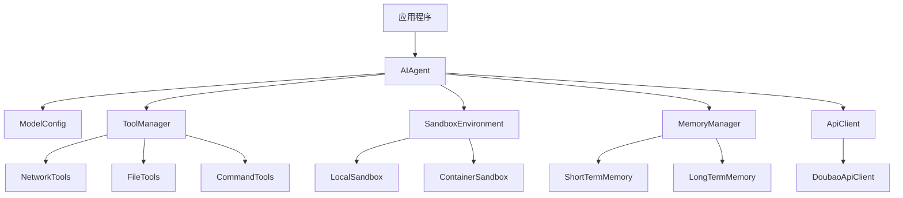

# 豆包模型 AI 接入框架实现计划

## 1. 项目背景与目标

### 1.1 背景
当前项目是一个名为 AiSmartDrill.App 的 WPF 应用程序，已经集成了基本的 AI 功能，使用豆包模型进行错题分析、题目推荐和学习计划生成。

### 1.2 目标
设计一个专注于豆包模型的 AI 接入框架，参考 DeerFlow 的架构思想，提供完整的工具集成、沙箱环境、记忆系统和代理架构。

## 2. 架构设计

### 2.1 核心组件

| 组件 | 职责 | 文件位置 | 状态 |
|------|------|----------|------|
| 模型配置 | 管理豆包模型的配置参数 | src/AiSmartDrill.App/Drill/Ai/Config/ | 已实现 |
| API 客户端 | 处理与豆包 API 的通信 | src/AiSmartDrill.App/Drill/Ai/Client/ | 部分实现（接口和模型已定义） |
| 工具集成 | 提供网络搜索、文件操作等工具 | src/AiSmartDrill.App/Drill/Ai/Tools/ | 未实现 |
| 沙箱环境 | 提供安全的执行环境 | src/AiSmartDrill.App/Drill/Ai/Sandbox/ | 未实现 |
| 记忆系统 | 管理短期和长期记忆 | src/AiSmartDrill.App/Drill/Ai/Memory/ | 未实现 |
| 代理架构 | 构建完整的 AI 代理 | src/AiSmartDrill.App/Drill/Ai/Agent/ | 未实现 |

### 2.2 依赖关系



## 3. 实现计划

### 3.1 模型配置（已实现）

1. **创建配置类**
   - `DoubaoModelConfig.cs`：强类型配置类，包含 API 密钥、模型名称、基础 URL 等参数
   - `DoubaoModelOptions.cs`：选项类，用于依赖注入配置

2. **配置参数**
   - API 密钥：从 appsettings.json 读取
   - 模型名称：支持 doubao-seed-1.8 等模型
   - 基础 URL：`https://ark.cn-beijing.volces.com/api/v3`
   - 超时设置：默认 30 秒
   - 最大重试次数：默认 3 次
   - 支持思考能力（thinking）和视觉能力（vision）

### 3.2 API 客户端（部分实现）

1. **创建 API 客户端**
   - `DoubaoApiClient.cs`：处理与豆包 API 的通信（待实现）
   - 实现 `IChatCompletionService` 接口（已定义）
   - 支持流式响应和非流式响应

2. **功能实现**
   - 构建请求体，支持工具调用和思考能力
   - 处理 API 响应，解析工具调用和内容
   - 实现错误处理和重试机制
   - 支持速率限制

### 3.3 工具集成（未实现）

1. **网络工具**
   - `NetworkTool.cs`：实现网络搜索和网页抓取
   - 使用 DuckDuckGo 或 Tavily API 进行搜索
   - 使用 Jina AI 或类似服务进行网页抓取

2. **文件工具**
   - `FileTool.cs`：实现文件读取、写入和搜索
   - 支持文本文件和 JSON 文件
   - 限制文件访问范围

3. **命令工具**
   - `CommandTool.cs`：在沙箱中执行安全命令
   - 支持基本的系统命令
   - 限制危险操作

4. **工具管理器**
   - `ToolManager.cs`：管理所有工具，提供工具注册和调用功能

### 3.4 沙箱环境（未实现）

1. **本地沙箱**
   - `LocalSandbox.cs`：直接在主机执行操作，适用于开发环境
   - 提供基本的安全控制

2. **容器沙箱**
   - `ContainerSandbox.cs`：使用 Docker 提供隔离环境，适用于生产环境
   - 提供更严格的安全控制

3. **安全控制**
   - 限制文件访问范围
   - 禁止危险操作
   - 监控执行过程

### 3.5 记忆系统（未实现）

1. **短期记忆**
   - `ShortTermMemory.cs`：存储当前对话的上下文
   - 支持上下文管理和优化

2. **长期记忆**
   - `LongTermMemory.cs`：存储和检索历史信息
   - 使用本地文件或数据库存储

3. **记忆检索**
   - 基于关键词搜索相关记忆
   - 支持记忆关联和分类

### 3.6 代理架构（未实现）

1. **AI 代理**
   - `AIAgent.cs`：构建完整的 AI 代理
   - 接收用户任务，调用豆包模型生成响应
   - 解析模型响应，执行工具调用，处理工具结果
   - 将工具执行结果整合到最终响应中
   - 将任务和结果保存到记忆系统

2. **任务处理流程**
   - 接收用户任务
   - 加载相关记忆
   - 构建模型请求
   - 调用豆包模型
   - 解析模型响应
   - 执行工具调用（如果需要）
   - 整合工具结果
   - 更新记忆
   - 返回最终响应

## 4. 技术实现要点

### 4.1 技术栈
- .NET 7.0+
- C# 10+
- HttpClient 进行 API 调用
- 依赖注入模式
- 异步处理
- 强类型配置

### 4.2 错误处理
- 实现适当的错误处理和重试机制
- 添加详细的日志记录
- 提供健康检查和监控

### 4.3 安全考虑
- 确保 API 密钥的安全管理，避免硬编码
- 实现沙箱环境的安全控制
- 限制文件访问范围
- 禁止危险操作

### 4.4 性能优化
- 实现速率限制，防止 API 调用过于频繁
- 优化上下文管理，提高模型性能
- 使用异步处理提高响应速度

## 5. 实现步骤

### 5.1 第一阶段：基础架构（进行中）
1. 创建模型配置类（已完成）
2. 实现 API 客户端（接口和模型已定义，实现待完成）
3. 建立基本的依赖注入配置（待完成）

### 5.2 第二阶段：核心功能
1. 实现工具集成
2. 构建沙箱环境
3. 实现记忆系统

### 5.3 第三阶段：代理架构
1. 实现 AI 代理
2. 完善任务处理流程
3. 整合所有组件

### 5.4 第四阶段：测试与优化
1. 编写单元测试
2. 进行集成测试
3. 优化性能和安全性

## 6. 输入输出示例

### 6.1 输入
```csharp
var agent = new AIAgent(config);
var result = await agent.ProcessTaskAsync("编写一个 C# 函数计算斐波那契数列");
Console.WriteLine(result);
```

### 6.2 输出
```
我已经为您编写了一个计算斐波那契数列的 C# 函数：

```csharp
public static int Fibonacci(int n) {
    if (n <= 1) return n;
    return Fibonacci(n - 1) + Fibonacci(n - 2);
}
```

这个函数使用递归方法计算斐波那契数列。如果您需要迭代版本或其他优化，请告诉我。
```

## 7. 风险与应对措施

### 7.1 风险
- API 调用失败或超时
- 模型响应不符合预期
- 工具执行安全风险
- 记忆系统性能问题

### 7.2 应对措施
- 实现完善的错误处理和重试机制
- 添加模型响应验证和错误处理
- 加强沙箱环境的安全控制
- 优化记忆系统的存储和检索

## 8. 总结

本实现计划为 .NET C# 应用程序提供了一个专注于豆包模型的 AI 接入框架，参考 DeerFlow 的架构思想，实现了完整的工具集成、沙箱环境、记忆系统和代理架构。通过这个框架，应用程序可以更有效地利用豆包模型的能力，提供更智能、更安全的 AI 服务。